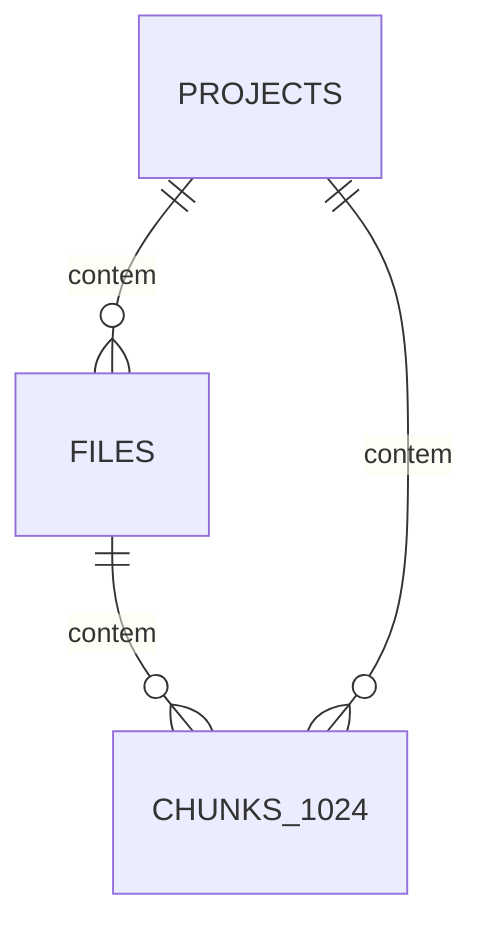
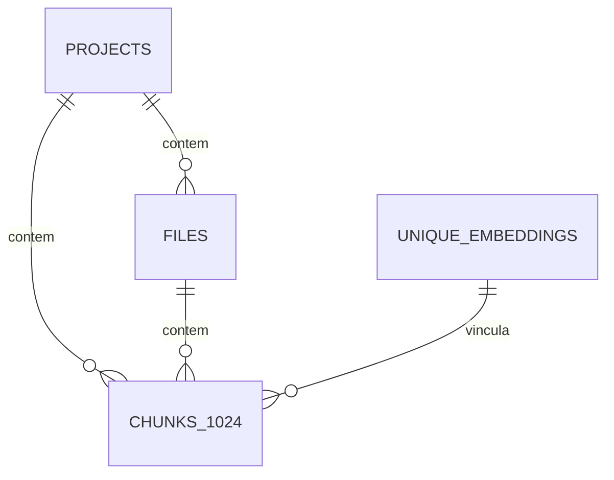

# Requisitos de Engenharia: De-duplicação Global de Embeddings no semidx

Este documento especifica os requisitos técnicos e as mudanças de arquitetura necessárias para implementar a **De-duplicação Global de Embeddings** no servidor `semidx`. 

---

## 1. Contexto e Problema

Atualmente, o `semidx` gerencia arquivos e chunks de forma estritamente isolada por projeto (`project_id`). O banco de dados (tanto Postgres com pgvector quanto SQLite) possui as seguintes restrições:

1. A tabela `files` possui a restrição única `UNIQUE (project_id, path, hash)`.
2. A tabela `chunks_1024` armazena o conteúdo de texto (`content`) e o vetor de embedding (`embedding`) diretamente em suas linhas, vinculados diretamente a um `project_id` e a um `file_id` específicos.

### O Impacto:
Quando o mesmo arquivo ou biblioteca compartilhada existe em múltiplos subprojetos locais (ex: estruturas organizacionais de microsserviços ou monorepos como o `P4Admin`), a indexação executa os seguintes passos redundantes:
* O arquivo é lido e dividido em chunks repetidamente para cada projeto.
* O servidor faz chamadas HTTP redundantes para a API de embeddings (Ollama ou provedores em nuvem como Gemini) para gerar vetores idênticos para textos idênticos.
* Em ambientes locais (homelab rodando Ollama em CPU ou GPUs compartilhadas), isso gera gargalos significativos de performance, estendendo o tempo de indexação de minutos para horas e gerando timeouts de rede.

---

## 2. Objetivos

* **Redução de Custo Computacional:** Eliminar chamadas redundantes a provedores de embeddings (locais ou na nuvem) para conteúdos de texto que o servidor já indexou anteriormente.
* **Aceleração do Tempo de Indexação:** Permitir que novos projetos ou worktrees com código redundante/compartilhado sejam indexados de forma quase instantânea (apenas criando vínculos relacionais no banco de dados).
* **Eficiência de Armazenamento:** Evitar o crescimento duplicado de vetores de alta dimensão (1024d) no Postgres/SQLite.

---

## 3. Requisitos Funcionais (RF)

### RF01 - Dicionário Global de Embeddings
O servidor de banco de dados deve possuir uma tabela global centralizada para armazenar os blocos de textos e seus respectivos vetores.
* O armazenamento deve ser indexado por um hash do conteúdo e o modelo utilizado.

### RF02 - Isolamento por Modelo de Embedding
Como diferentes projetos podem utilizar modelos de embeddings distintos (ex: `bge-m3`, `all-minilm`), os vetores reutilizados devem corresponder exatamente ao mesmo modelo. 
* A chave de de-duplicação deve ser composta por `(model_name, content_hash)`.

### RF03 - Mapeamento Relacional de Chunks
A tabela de chunks del projeto (`chunks_1024`) deve deixar de armazenar o vetor e o texto plano diretamente. Ela passará a referenciar o registro correspondente no Dicionário Global de Embeddings.

### RF04 - Bypass de API de Embedding (Cache Hit)
Durante a indexação de um arquivo:
1. O texto do chunk é gerado pelo indexador.
2. O servidor calcula o hash SHA-256 do texto plano.
3. O servidor realiza uma busca rápida na tabela global pelo `content_hash` e `model`.
4. **Se houver correspondência (Hit):** O servidor pula a chamada de API de embeddings (Ollama/Gemini) e cria o registro relacional apontando para o vetor existente.
5. **Se não houver correspondência (Miss):** O servidor chama o provedor de embeddings, salva o novo vetor na tabela global e cria o registro relacional.

### RF05 - Coleta de Lixo de Chunks Órfãos (Garbage Collection)
Quando um projeto ou arquivo for removido do `semidx`:
* A remoção do arquivo limpa os vínculos na tabela relacional.
* Chunks órfãos na tabela global (sem nenhum projeto associado) podem ser limpos por uma tarefa periódica ou mantidos sob uma política de cache (com limite de tempo ou LRU).

---

## 4. Requisitos Não-Funcionais (RNF)

* **RNF01 - Baixa Latência de Lookup:** A consulta de verificação de hash no banco de dados deve levar no máximo **5ms** por lote de chunks para não impactar o fluxo de processamento do pipeline.
* **RNF02 - Integridade Referencial:** A exclusão de um projeto ou arquivo não deve corromper a tabela global de embeddings compartilhados.

---

## 5. Proposta de Modelagem de Banco de Dados

### Estrutura Atual


### Nova Estrutura Proposta


### DDL da Nova Modelagem (PostgreSQL Exemplo)

```sql
-- 1. Criar a tabela global de de-duplicação de embeddings
CREATE TABLE unique_embeddings (
    hash VARCHAR(64) NOT NULL,            -- SHA-256 do texto do chunk
    model VARCHAR(100) NOT NULL,          -- Nome do modelo (ex: bge-m3)
    content TEXT NOT NULL,                -- Texto plano do chunk
    embedding vector(1024) NOT NULL,      -- Vetor pgvector
    created_at TIMESTAMP DEFAULT now(),
    PRIMARY KEY (hash, model)
);

-- Indice HNSW para busca semântica global rápida
CREATE INDEX idx_unique_embeddings_hnsw 
ON unique_embeddings USING hnsw (embedding vector_cosine_ops);

-- 2. Modificar/Criar a tabela de junção chunks_1024
CREATE TABLE chunks_1024 (
    id SERIAL PRIMARY KEY,
    project_id INT REFERENCES projects(id) ON DELETE CASCADE,
    file_id INT REFERENCES files(id) ON DELETE CASCADE,
    chunk_index INT NOT NULL,
    start_line INT NOT NULL,
    end_line INT NOT NULL,
    embedding_hash VARCHAR(64) NOT NULL,
    model VARCHAR(100) NOT NULL,
    created_at TIMESTAMP DEFAULT now(),
    FOREIGN KEY (embedding_hash, model) REFERENCES unique_embeddings(hash, model),
    UNIQUE (project_id, file_id, chunk_index)
);

-- Índices de consulta rápida
CREATE INDEX idx_chunks_project ON chunks_1024(project_id);
CREATE INDEX idx_chunks_file ON chunks_1024(file_id);
```

---

## 6. Fluxo Lógico de Indexação (Go Pseudocódigo)

```go
func IndexChunk(ctx context.Context, db *sql.DB, client *embedding.Client, chunk *Chunk) error {
    // 1. Calcular hash do conteúdo do chunk
    hash := crypto.SHA256(chunk.Content)
    
    // 2. Tentar recuperar o embedding existente
    var embedding []float32
    err := db.QueryRowContext(ctx, 
        "SELECT embedding FROM unique_embeddings WHERE hash = $1 AND model = $2", 
        hash, chunk.Model).Scan(&embedding)
        
    if err == sql.ErrNoRows {
        // Cache Miss: Gerar novo embedding na GPU/API
        embedding, err = client.Generate(ctx, chunk.Content, chunk.Model)
        if err != nil {
            return fmt.Errorf("generate embedding: %w", err)
        }
        
        // Salvar no dicionário global (ignora se outro worker inseriu concorrentemente)
        _, err = db.ExecContext(ctx, `
            INSERT INTO unique_embeddings (hash, model, content, embedding) 
            VALUES ($1, $2, $3, $4) ON CONFLICT DO NOTHING`, 
            hash, chunk.Model, chunk.Content, pgvector.NewVector(embedding))
        if err != nil {
            return fmt.Errorf("save unique embedding: %w", err)
        }
    } else if err != nil {
        return fmt.Errorf("query unique embedding: %w", err)
    }
    
    // 3. Criar o vínculo do chunk para o projeto atual
    _, err = db.ExecContext(ctx, `
        INSERT INTO chunks_1024 (project_id, file_id, chunk_index, start_line, end_line, embedding_hash, model) 
        VALUES ($1, $2, $3, $4, $5, $6, $7)`,
        chunk.ProjectID, chunk.FileID, chunk.Index, chunk.StartLine, chunk.EndLine, hash, chunk.Model)
        
    return err
}
```
